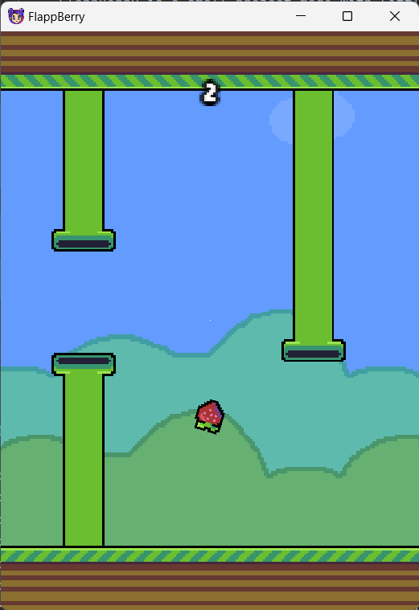
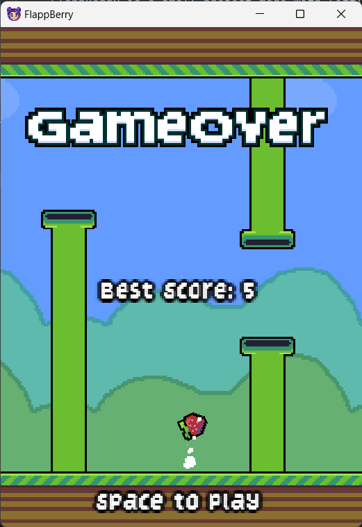

## FlappBerry
FlappBerry is a small project made with LittleKt, inspired by the classic Flappy Bird. It's a simple game where you control a "berry" that jumps when you press the space bar.

### Controls
 * Key [Space] for jump.

### Project Purpose
The goal of this project was to:
 * Learn how to use LittleKt, a game development framework.
 * Improve my skills in Kotlin by experimenting with its capabilities for game development.
 * Practice my pixel art.
### ScreenShots

Here is a screenshot of the game:

## Usage

Clone this repo and open up in IntelliJ to get started. Each platform target contains a class to execute for their
respective platform.

### JVM

#### Running

Run `LwjglApp` to execute on the desktop.

#### Deploying

A custom deploy task is created specifically for JVM. Run the `package/packageFatJar` gradle task to create a fat
executable JAR. This task can be tinkered with in the `build.gradlek.kts` file.

If and when the packages are renamed from `com.game.flappberry.LwjglApp` to whatever, ensure to update the `jvm.mainClass`
property in the `gradle.properties` file to ensure that the `packageFatJar` task will work properly.

A jar will be outputted in the build directory. To run this JAR, use the following
command, replacing the name of the JAR, if needed: `java -jar --enable-preview game-1.0-all.jar`

If you are running on Mac OS, then the following command can be
used: `java -jar -XstartOnFirstThread --enable-preview game-1.0-all.jar`

### JS

#### Running

Run the `kotlin browser/jsBrowserRun` gradle task like any other **Kotlin/JS** project to run in development mode.

#### Deploying

Run the `kotlin browser/jsBrowserDistribution` gradle task to create a distribution build. This build will require a
webserver in order to run.
